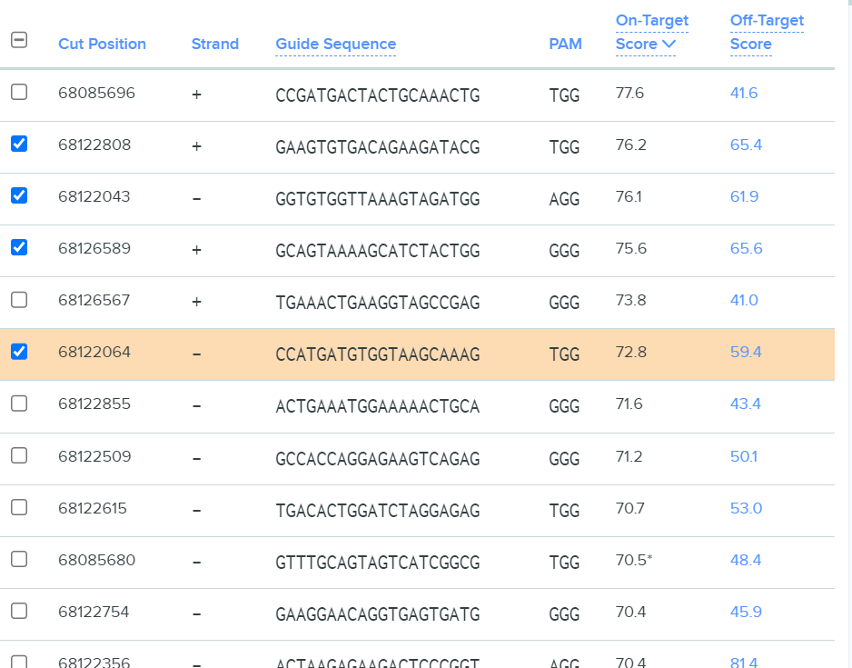
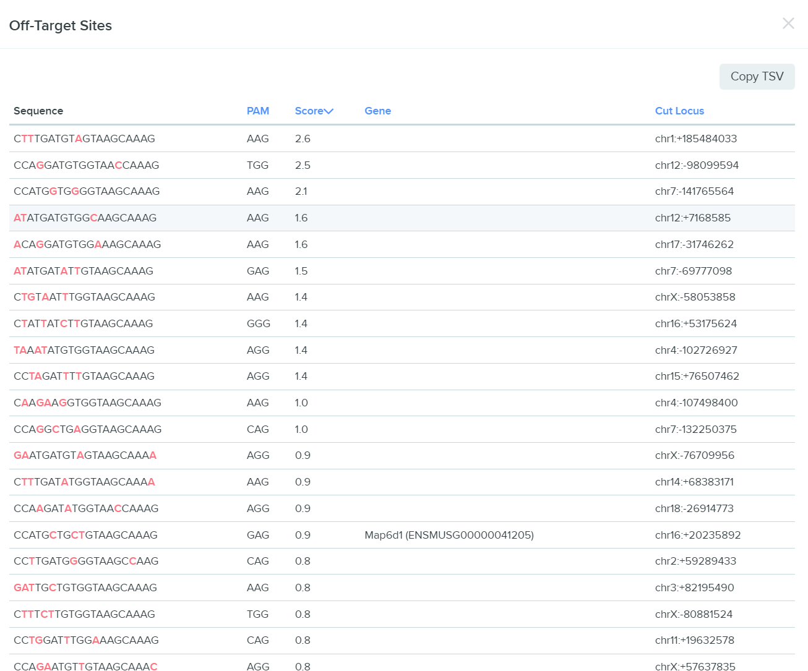
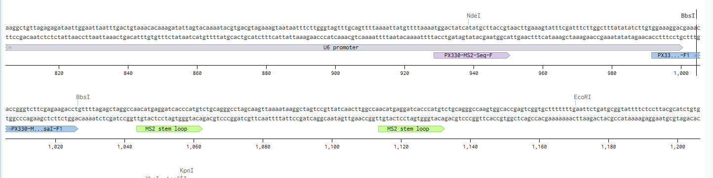
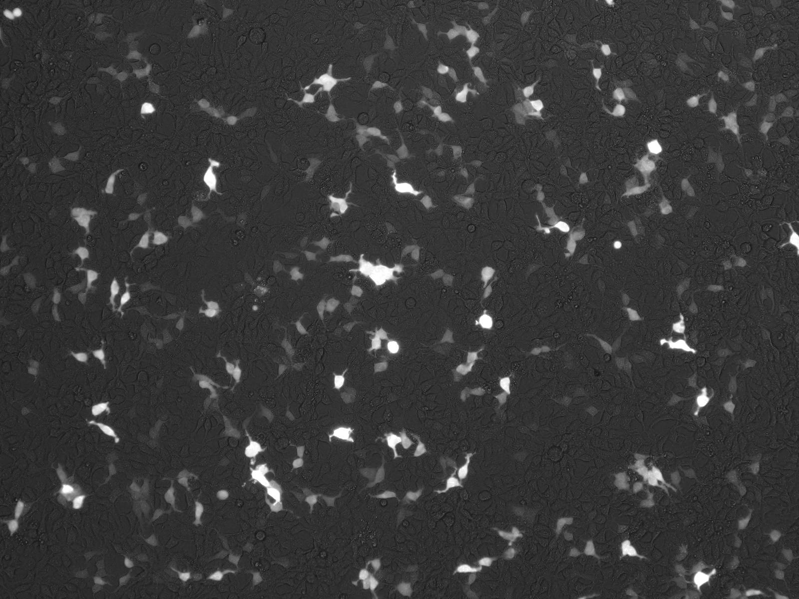
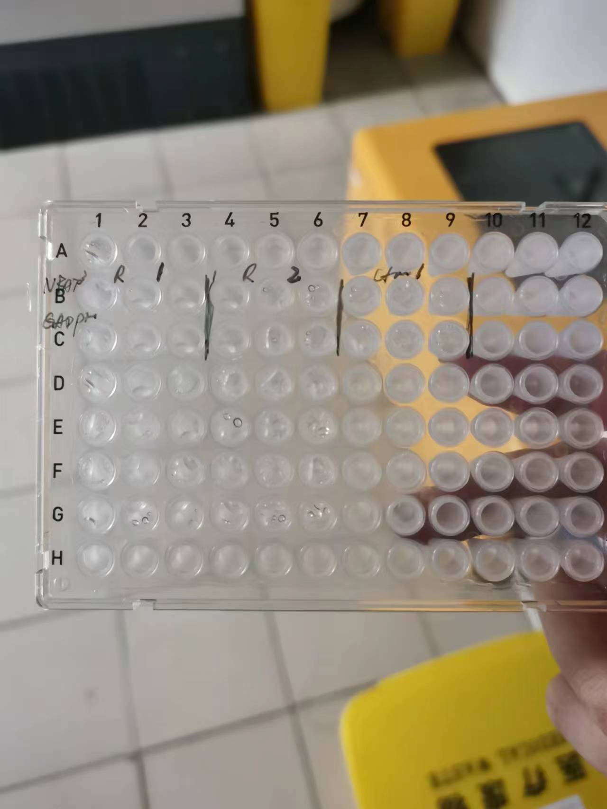
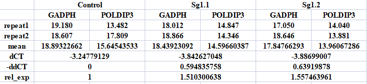

 **实验报告** 

 刘迪 生 02 2020011588 

 合作人：刘天佑 生 02

---

 **目录** 

- [1. 实验背景及目的](#1-实验背景及目的)
- [2. 实验设计](#2-实验设计)
  - [2.1. 转染设置](#21-转染设置)
  - [2.2. qPCR 设置](#22-qpcr-设置)
- [3. 实验步骤](#3-实验步骤)
  - [3.1. 实验 1：设计 Chrisper 的 sgRNA](#31-实验-1设计-chrisper-的-sgrna)
    - [3.1.1. 得到 sgRNA 的候选序列](#311-得到-sgrna-的候选序列)
    - [3.1.2. 确定酶切的粘性末端序列](#312-确定酶切的粘性末端序列)
    - [3.1.3. 设计 sgRNA 的序列](#313-设计-sgrna-的序列)
  - [3.2. 实验 2：转化](#32-实验-2转化)
    - [3.2.1. annealing](#321-annealing)
    - [3.2.2. digest plasmid](#322-digest-plasmid)
    - [3.2.3. 酶切产物纯化](#323-酶切产物纯化)
    - [3.2.4. 连接](#324-连接)
    - [3.2.5. 转化](#325-转化)
    - [3.2.6. 提取质粒](#326-提取质粒)
    - [3.2.7. 质粒测序](#327-质粒测序)
  - [3.3. 实验 3：细胞培养与转染](#33-实验-3细胞培养与转染)
    - [3.3.1. day0：铺细胞](#331-day0铺细胞)
      - [3.3.1.1. 分装](#3311-分装)
      - [3.3.1.2. 细胞计数](#3312-细胞计数)
      - [3.3.1.3. 细胞置于 24 孔板培养](#3313-细胞置于-24-孔板培养)
    - [3.3.2. day1：转染](#332-day1转染)
    - [3.3.3. day2：细胞状态与质粒表达情况观察](#333-day2细胞状态与质粒表达情况观察)
    - [3.3.4. day3：收细胞](#334-day3收细胞)
  - [3.4. 实验 4：DNA 与 RNA 提取，DNA 测序，qPCR](#34-实验-4dna-与-rna-提取dna-测序qpcr)
    - [3.4.1. 粗提 DNA 及测序](#341-粗提-dna-及测序)
    - [3.4.2. RNA 提取](#342-rna-提取)
    - [3.4.3. RNA 反转录为 cDNA](#343-rna-反转录为-cdna)
    - [3.4.4. qPCR](#344-qpcr)
- [4. 实验结果数据分析](#4-实验结果数据分析)
- [5. 结论](#5-结论)
- [6. 其他课程笔记](#6-其他课程笔记)

---

# 1. 实验背景及目的

通过基因组调控网络的预测，预测结果表明基因 NFATC3 会对基因 POLDIP3 产生负调控。本实验旨在通过实验验证预测结果是否正确，具体而言，本实验希望通过 Chrisper 技术 knock out NFATC3 基因，再通过 qPCR 的方式检测 POLDIP3 基因的 mRNA 含量是否产生显著的变化。实验预期在 KO NFATC3 后，负调控效果解除，POLDIP3 的 mRNA 含量会有显著的上升。

# 2. 实验设计

## 2.1. 转染设置

实验组（sg1，sg2）：转入敲除 NFATC3 的 Chrisper 载体，sgRNA target 是针对 NFATC3 设计的，通过在前几个外显子内引入移码突变导致无法表达正确蛋白，达到敲除细胞的目的。（本轮实验为了提高成功率，选择两种不同的 sgRNA 设计）

对照组（control，实际上为制作克隆时的空载质粒）：较为合适的 control 设置为 random sgRNA 的 Chrisper 载体，尽可能保证对照组和实验组的细胞内外来压力是类似的（更优的选择是导入一个敲除无关基因的 sgRNA，使得 DNA 损伤也尽量保持相同），本实验选择导入制作克隆时的空载质粒，相当于引入一个 random sgRNA，可能不会导致 Chrisper 工具的切割。

每组做两个 replicate。

## 2.2. qPCR 设置

通过 qPCR 检测目标基因 POLDIP3 的表达量是否因为 NFATC3 的敲除受到影响。为了排除实验操作和细胞状态造成的潜在误差，同时需要检测一个内参基因 GAPDH。

每个实验组/对照组中，每个检测基因进行两个 repeat。

# 3. 实验步骤

## 3.1. 实验 1：设计 Chrisper 的 sgRNA

### 3.1.1. 得到 sgRNA 的候选序列

- 登录[Benchling](https://www.benchling.com/)
- 导入 NFATC3 基因，参考基因组选择人类基因组 GRCh38，导入 cDNA 
- 在 cDNA 上自 CDS 开始选取 894 个 bp，选择 Chrisper 功能，并 design 
- 首先根据 On-Target Score 从大到小排序，再在有最高 On-Target Score 的几条序列中，选择 Off-Target Score 较高的序列作为候选 sgRNA  选择其中的两条`GCAGTAAAAGCATCTACTGG`和`CCATGATGTGGTAAGCAAAG`作为目标 sgRNA，分别对应的 Off-target 序列如下：  

### 3.1.2. 确定酶切的粘性末端序列

 由于 BbsI 的酶切位点和识别序列不是相同的，因此 BbsI 可以酶切出两段不同的粘性末端。Forward 5' `CACC`，Reverse 5' `AAAC`。

### 3.1.3. 设计 sgRNA 的序列

第一组 sgRNA

> CACCGCAGTAAAAGCATCTACTGG   AAACCCAGTAGATGCTTTTACTGC

第二组 sgRNA

> AAACCTTTGCTTACCACATCATGG   CACCCCATGATGTGGTAAGCAAAG

## 3.2. 实验 2：转化

### 3.2.1. annealing

1. 配置反应体系

|         reagent          | volume (μl)  |
| :----------------------: | :----------: |
|   100uM forward oligo    |      1       |
|   100uM reverse oligo    |      1       |
| 10 x T4 ligation buffer  |      1       |
|         T4 PNK           |     0.5      |
|          ddH2O           |     6.5      |
|          total           |     10       |

2. 37℃, 1hr
3. 95℃, 5min
4. slowly cool down to 25℃ in 5 min
5. 加入 90 μl ddH2O 稀释(1:10 稀释)
6. keep at 4℃ 备用

**备注**

- PNK 为给合成的 oligo 加上磷酸根的酶

### 3.2.2. digest plasmid

实验员：刘天佑

1. 测量质粒浓度，稀释 10 倍后为 18.519 ng/μl，因此加入 3μl 质粒
2. 配置酶切反应体系

|           Contents                |     Volume (μl)  |
| :-------------------------------: | :--------------: |
| PX330M Plasmid backbone (500ng)   |         3        |
|               ddH2O               |       14.5       |
|      10X Fast digest buffer       |         2        |
|           BpiI (BbsI)             |       0.5        |

3. 室温孵育 1 h

### 3.2.3. 酶切产物纯化

1. 质粒酶切产物(加入 80μl ddH2O)稀释到 100 μl
2. 根据 kit protocol 进行酶切产物纯化
3. 最后洗脱前室温晾干酒精 5 min，使用 20 μl 65 ℃ 水洗脱质粒
4. 测得质粒浓度 10.101 ng/μl

### 3.2.4. 连接

做三组，sg1,sg2 和 control，对应的 annealing products 分别为 sg1,sg2,ddH2O。

1. 配置反应体系

|    Contents          |     Volume (μl)  |
| :------------------: | :--------------: |
| 10x T4 ligase buffer |        1         |
|      T4 ligase       |       0.5        |
|   Digested plasmid   |       1.5        |
|  Annealing products  |        7         |

2. 室温反应 1 h

**备注** 载体与连接片段的物质的量比计算

- 质粒物质的量：$330 \times 8544 \times 2=5639040$ g/mol
- 20 μl 10.101 ng/μl 质粒取 1.5 μl，共取 37.5ng，对应$0.665 \times 10^{-5}$ nmol
- 退火产物物质的量为$0.7 \times 10^{-2}$ nmol
- 退火产物与质粒的物质的量比约为 1000，差 3 个数量级

### 3.2.5. 转化

实验员：刘迪、刘天佑，涂板工作由刘天佑完成

1. thaw cells(stable3) on ice until melt
2. add 连接好的 plasmid（1 μl） to cells(10 μl)，混匀
3. incubate on ice for 30 min
4. turn on water bath and set temperature to 42 ℃
5. heat shock bacteria at 42 ℃ for 60s
6. 将菌 put back on ice for 2 min
7. Transfer all liquid to the A+ plate,smear evenly
8. Incubate at 37℃ for 14 h

结果如下： 

### 3.2.6. 提取质粒

实验员：刘迪、刘天佑，挑菌培养、浓度测量工作由刘天佑完成

1. 挑取 sg1，sg2 单克隆各 3 个至 5 ml 氨苄抗性培养基中，37 ℃ 培养 16 h
2. 4000 rpm 离心 10 min，弃去培养基
3. 加入 250 μl 加入 RNAse 的 solution1，吹打重悬菌液，转移至 1.5 ml EP 管中
4. 加入 250 μl solution2，颠倒混匀，静置 3 min
5. 加入 350 μl solution3，立刻颠倒混匀，观察到白色絮状物
6. 12000 rpm 离心 10 min，将上清转移至柱子中，弃去沉淀
7. 12000 rpm 离心 1 min，弃去收集管中液体
8. 加入 Buffer PW1 500 μl，12000 rpm 离心 1 min，弃去收集管中液体
9. 加入 Buffer PW2（加入乙醇后） 600 μl，12000 rpm 离心 1 min，弃去收集管中液体，重复一次该步骤
10. 12000 rpm 离心 1 min，将甩干后的吸附柱转移至干燥的 1.5 ml EP 管中，室温晾干 2.5 min
11. 加入 60 ℃ 30 μl ddH2O 于吸附柱中，静置 2 min，12000 rpm 离心 1 min
12. 测量浓度

| Name  |  Concentration (ng/μl)  |
| :---: | :---------------------: |
| sg2 1 |         38.106          |
| sg2 2 |         38.240          |
| sg2 3 |         50.067          |
| sg1 1 |         71.894          |
| sg1 2 |         74.880          |
| sg1 3 |         46.909          |

### 3.2.7. 质粒测序

测序结果如下：   sg1 中 C6 测序结果较好，C5 有突变，C4 有较多双峰重叠(可能是挑菌时挑到了两个)，因此选择 sg1 3 号质粒进行后续转染实验

sg2 中 C1,C3 测序结果较好，C2 有突变，不使用，因此使用 sg2 1 和 sg2 3 号质粒进行后续转染实验

## 3.3. 实验 3：细胞培养与转染

### 3.3.1. day0：铺细胞

#### 3.3.1.1. 分装

(细胞的分装由助教完成，10 cm 皿培养 293T 分装 3 管，每管 1 ml) 大致步骤：弃去 DMEM++培养基，PBS 清洗，弃去 PBS，加入 0.25 %胰酶消化，37 ℃ 1 min，DMEM++终止消化，离心，弃上清，加入 DMEM++培养基重悬细胞，分装每管 1 ml

#### 3.3.1.2. 细胞计数

实验员：刘天佑

取 10 μl 细胞液镜检计数，测得细胞浓度为 $16 \times 10^5$ 个/ml **备注**

1. 数得视野内细胞总数约 640 个
2. 浓度估计为 $640 \div 4 \times 10^4=16 \times 10^5$ 个/ml

#### 3.3.1.3. 细胞置于 24 孔板培养

1. 加入 3 ml DMEM++稀释细胞液至 $4 \times 10^5$ 个/ml 浓度
2. 500 μl 一个孔，每孔约 $2 \times 10^5$个细胞，铺 8 个孔(最后一个为废孔，有气泡)
3. 8 字混匀，置于 37 ℃ 5 % CO2 恒温培养约 19 h

### 3.3.2. day1：转染

实验员：刘迪、刘天佑，将配置好的转染试剂加入细胞培养液由刘天佑完成

本次实验 control 是空载质粒，可以认为是 random 的 sgRNA

0. 细胞培养约 19 h，观察细胞状态，细胞铺的较密，约长到 80 %左右
1. 配置转染试剂

   原始试剂浓度：

   |          Name           |  Concentration (ng/μl)  |
   | :---------------------: | :---------------------: |
   |          sg1 3          |         46.909          |
   |      sg1 from zyy       |         50.018          |
   |          sg2 1          |         38.106          |
   |          sg2 3          |         50.067          |
   |           GFP           |           100           |
   | PX330M Plasmid backbone |         18.519          |

   最终每管转染试剂混合液的质粒加入体积如下：

   | Tube Number |         Plasmid         | volume (μl)  |  type   |
   | :---------: | :---------------------: | :----------: | :-----: |
   |      1      |          sg1 3          |    10.00     |  exp1   |
   |      2      |      sg1 from zyy       |     9.36     |  exp1   |
   |      3      |          sg2 1          |    12.50     |  exp2   |
   |      4      |          sg2 3          |     9.36     |  exp2   |
   |      5      | PX330M Plasmid backbone |     2.50     | Control |
   |      6      | PX330M Plasmid backbone |     2.50     | Control |

   此外每管中还应含有 50 μl OptiMEM，1.5 μl 2X PEI，0.25 μl GFP

2. 具体配置方法为将 PEI 与对应质粒分别溶于 25 μl OptiMEM 后，分别震荡混匀，再将两管混合物混合，震荡混匀
3. 室温孵育 20 min
4. 均匀将转染试剂和质粒加入细胞中，8 字均匀混匀，置于 37 ℃ 5 % CO2 恒温培养，共计培养约 48 h

### 3.3.3. day2：细胞状态与质粒表达情况观察

实验员：刘天佑

- Control
- 明场 
- 荧光 

- Exp
- 明场 
- 荧光 

- 经过 imergeJ 处理融合图片可计算对照组转染效率为 3.05%，实验组转染效率为 17.87%，对照组转染效率比较低，实验组的转染效率较高，可能会发生基因编辑，可以进行后续实验。

### 3.3.4. day3：收细胞

0. 挑选 sg1，sg2，control 荧光强度类似的各一个孔的细胞（保证转染效率接近）
1. 吸去培养基
2. 加入 200 μl PBS，摇晃洗涤
3. 吸去 PBS，加入 100 μl 胰酶消化，1 min 37 ℃ 消化
4. 加入 500 μl DMEM++ 终止
5. 吹打混匀细胞液，分装每管 275 μl，每种细胞两管，分别用以提取 DNA 与 RNA
6. 300 g 离心 3 min，去上清

## 3.4. 实验 4：DNA 与 RNA 提取，DNA 测序，qPCR

**DNA 测序目的在于检测 Chrisper 是否有正确敲除 NFATC3 基因，RNA 提取目的在于进行 qPCR 检测目标下游基因 POLDIP3 是否有受到调控，发生表达量的变化**

### 3.4.1. 粗提 DNA 及测序

1. 加入 50 μl Quick Extract solution 吹打混匀
2. PCR 仪器执行程序

| Temp (°C) | Time (min) |
| :-------: | :--------: |
|    65     |     15     |
|    68     |     15     |
|    98     |     10     |

3. 配置 tide 体系

|    Contents          |     Volume (μl)  |
| :------------------: | :--------------: |
| Forward primer(10uM) |        1         |
| Reverse primer(10uM) |        1         |
| 2xphanta master mix  |        10        |
|     QE template      |       0.5        |
|        Water         |       7.5        |

其中 QE template 即为上一步处理好的各 DNA 模板

4. PCR 仪器执行程序

|  temperature (℃)  | time (s) |
| :---------------: | :------: |
|        95         |   300    |
|        95         |    15    |
|        59         |    15    |
|        72         |    90    |
| CYCLE last 2 step |    32    |
|        72         |   300    |
|        16         |   ---    |

5. 送测
6. 测序结果使用[Tide](https://tide.nki.nl/)进行结果分析（由于细胞混合物进行基因组测序过程中，可能包含没有转染成功的细胞和成功转染的细胞，转染成功的细胞会出现基因组上片段丢失，因此测序读峰会出现重叠，需要通过算法进行信号分割）

选择 tide 模式，结果如下：

从结果来看，没有达到敲除效果，因此最后的 qPCR 并非使用本次自己转染的细胞，来自张咏妍同学转染的细胞，该细胞系实现了正确的基因敲除。

### 3.4.2. RNA 提取

1. 按照 kit 的 protocol 提取 RNA

**备注**（与 protocol 略微不同处）

1.  第 1 步，加入 400 μl 的 Buffer RL
2.  第 4 步，加入 400 μl Buffer RW2（而非 70 % 乙醇）
3.  第 11 步，室温放干 5 min，加入 30 μl RNase Free water 洗脱

4.  测量 RNA 浓度仅测量了转染 sg2 的细胞提取出的 RNA 浓度，125.988 ng/μl

### 3.4.3. RNA 反转录为 cDNA

按照 kit 的 protocol 反转录 cDNA

**备注**（与 protocol 略微不同处）

1. RNA 4 μl，ddH2O 8 μl，4x gDNA wiper Mix 4 μl
2. 最后反转录时 50 ℃ 孵育 45 min
3. keep at 4 ℃

### 3.4.4. qPCR

实验员：刘天佑、刘迪，其中引物酶混合物由刘迪配置，加入模板并进行 qPCR 过程由刘天佑完成

1. 体系(其中 template 来自张咏妍同学的细胞)

|      Contents         |   Volume (μl)  |
| :-------------------: | :------------: |
|       F Primer        |       1        |
|       R Primer        |       1        |
|          Mix          |       10       |
| Template(1:2 diluted) |      0.5       |
|         ddH2O         |      7.5       |

2. 每种转染体系(转染 sg1 和空载质粒) P 两种基因，一个是目的基因(F2)，一个是管家基因作为内参(F1)，每种重复两次

点样结果如图：

# 4. 实验结果数据分析

实验设置上，实验组与对照组实际上都各自只取了 1 个 replicate，每个 replicate 中进行了 2 个 repeat，因此对于每个实验组中的数据取平均处理，作为单次采样结果。实验结果处理如下表所示。

扩增曲线如下图所示

从数据处理结果来看，实验组 Sg1.1 和 Sg1.2 相较对照组，POLDIP3 表达量均有上调。

# 5. 结论

实验结果来看，确实存在 NFATC3 会对基因 POLDIP3 产生负调控，即在 NFATC3 敲除后，POLDIP3 表达上调，预测结果无误，但是由于样本数量太少，因此无法进行合理的统计分析。

从本次实验本身角度而言，大部分实验均成功完成，虽然部分结果为 negative result，可以改进的方面如下：

1. 挑菌的时候小心一点不要挑到多菌落（菌板培养时间要适中）
2. 摇菌可以再多摇一会，增加质粒的浓度，方便后续实验的进行
3. 做 Chrisper 敲除的时候可以多做一些 replicate，增加最后出现成功敲除细胞的可能性
4. 细胞转染期间多关注细胞状态，可能能增加一点转染效率
5. 如果可以应该扩大实验规模，做几个 replicate，方便后续进行统计分析

---

# 6. 其他课程笔记

[Click Here](https://diliu899.github.io/bioinfo_course/)

Lec6 开始为实验部分的部分记录，主要为实验原理的简单记录
