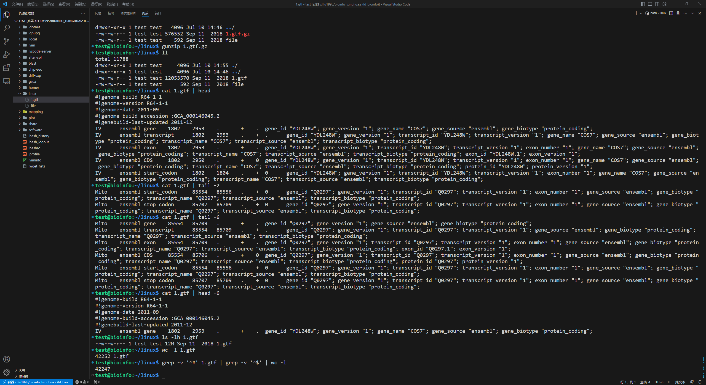
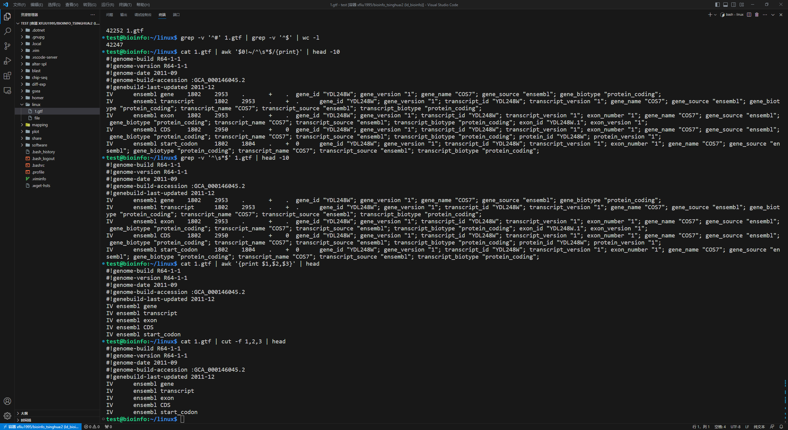
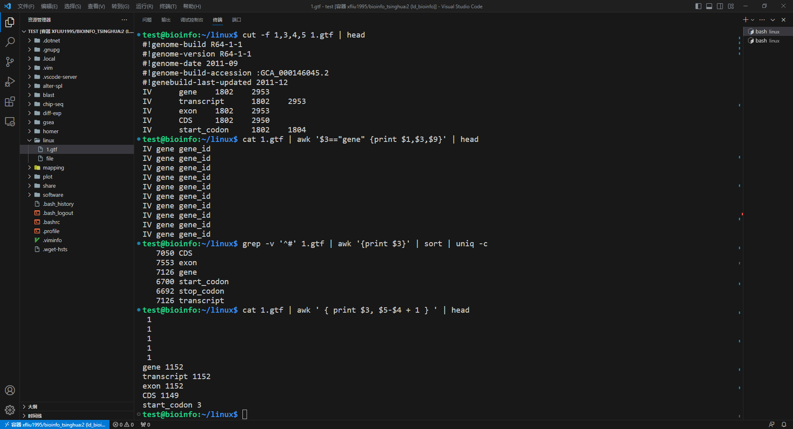
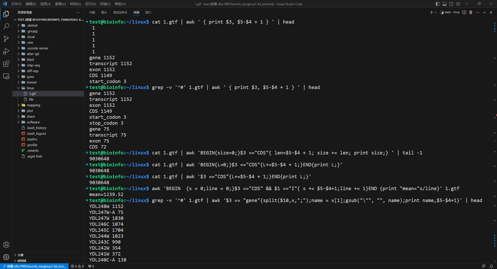
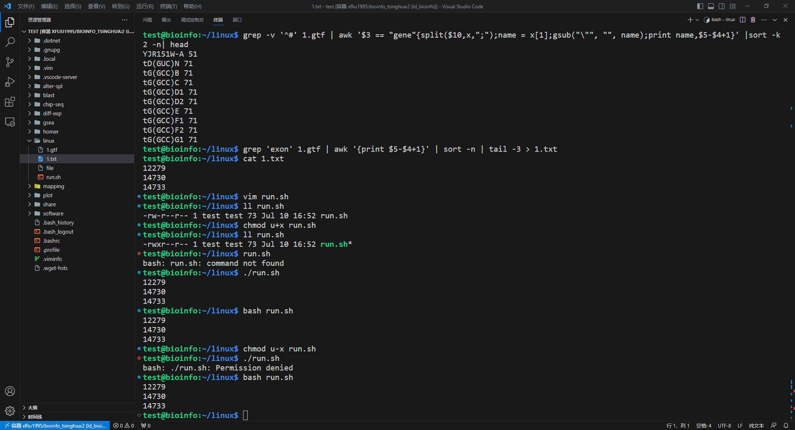
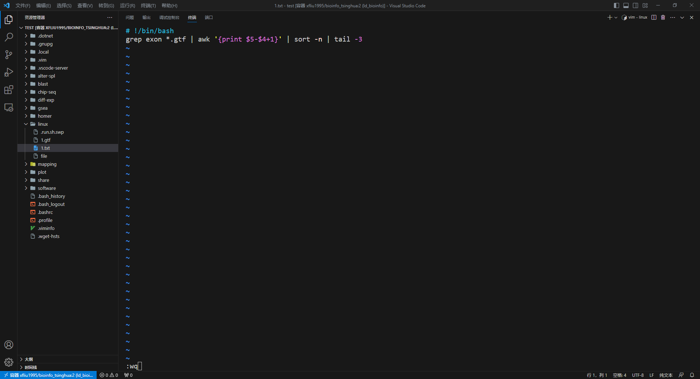

# 部分代码个人理解
1. 由于uniq命令只能去除相邻的重复值，因此需要先sort，将第3列相同的数值先合并在一起再执行uniq
```bash
grep -v '^#' 1.gtf | awk '{print $3}' | sort | uniq -c
```
2. awk的语法好C，但是编号却是从1开始的(x)。自带一个逐行执行的循环，`BEGIN`中执行变量定义，循环体为`condition{body}`形式（注意是逐行执行循环体内容的），`END`中执行额外需要单独执行的操作，感觉一般是输出一些循环体中的计算结果用的。此外在awk中`" "`和`' '`不可混用，前者用来指明字符串，后者用来指定执行开始的部分。
```bash
#计算所有CDS的总长度
cat 1.gtf | awk 'BEGIN{size=0;}$3 =="CDS"{ len=$5-$4 + 1; size += len; print "Size:", size } ' | tail -n 1
#或者用awk只在最后输出统计的结果:
cat 1.gtf | awk 'BEGIN{L=0;}$3 =="CDS"{L+=$5-$4 + 1;}END{print L;}'
#或者利用awk自动初始化的特性:
cat 1.gtf | awk '$3 =="CDS"{L+=$5-$4 + 1;}END{print L;}'
```
3. .sh脚本不指定解释器的情况下也可以直接用`bash`执行，指定解释器后的可执行.sh文件就可以直接用文件名来调用执行了

---
# 运行结果





